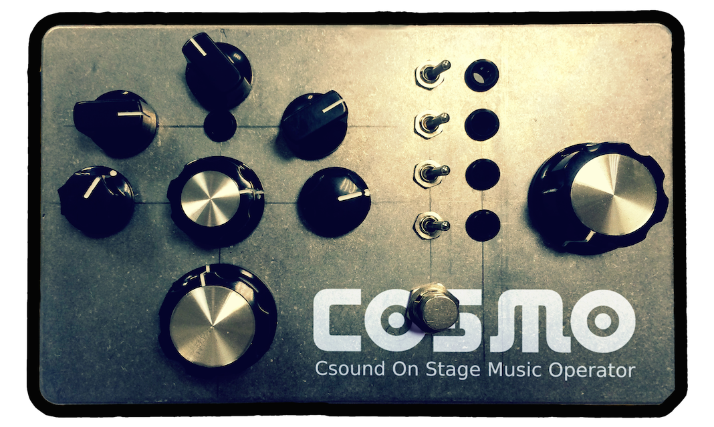
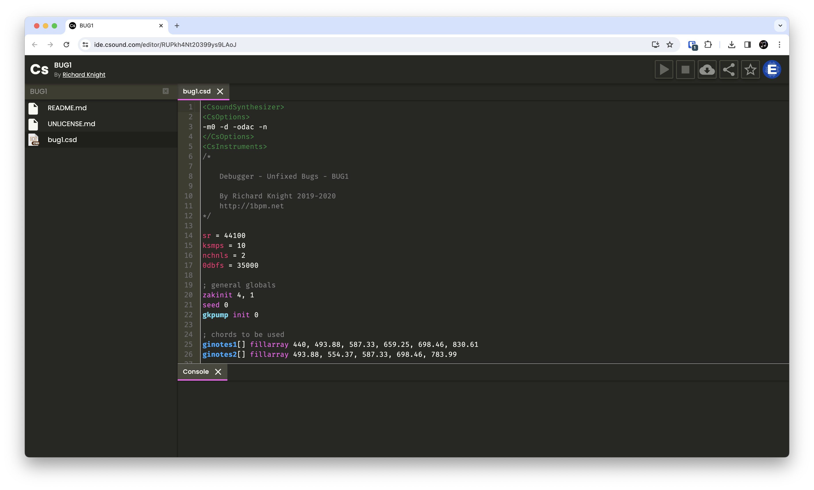
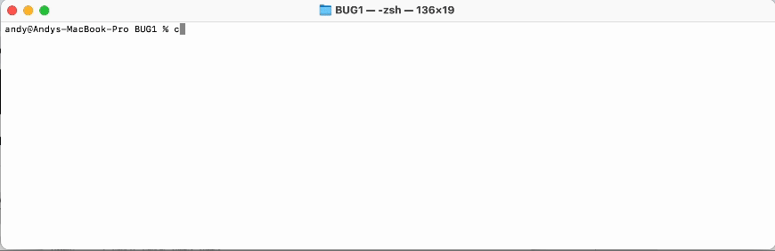
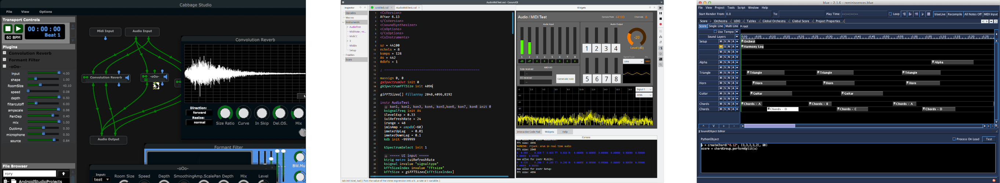
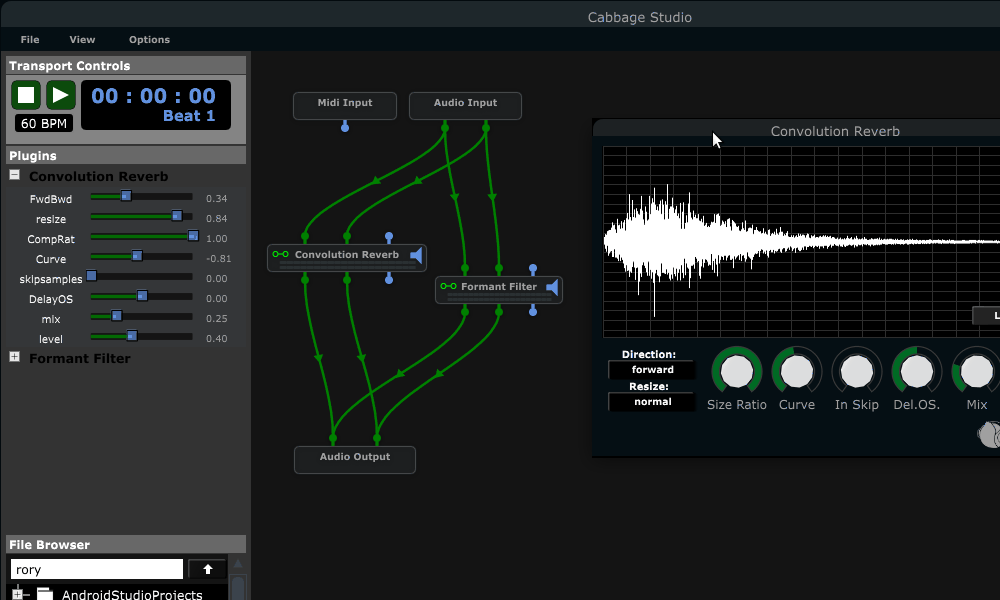
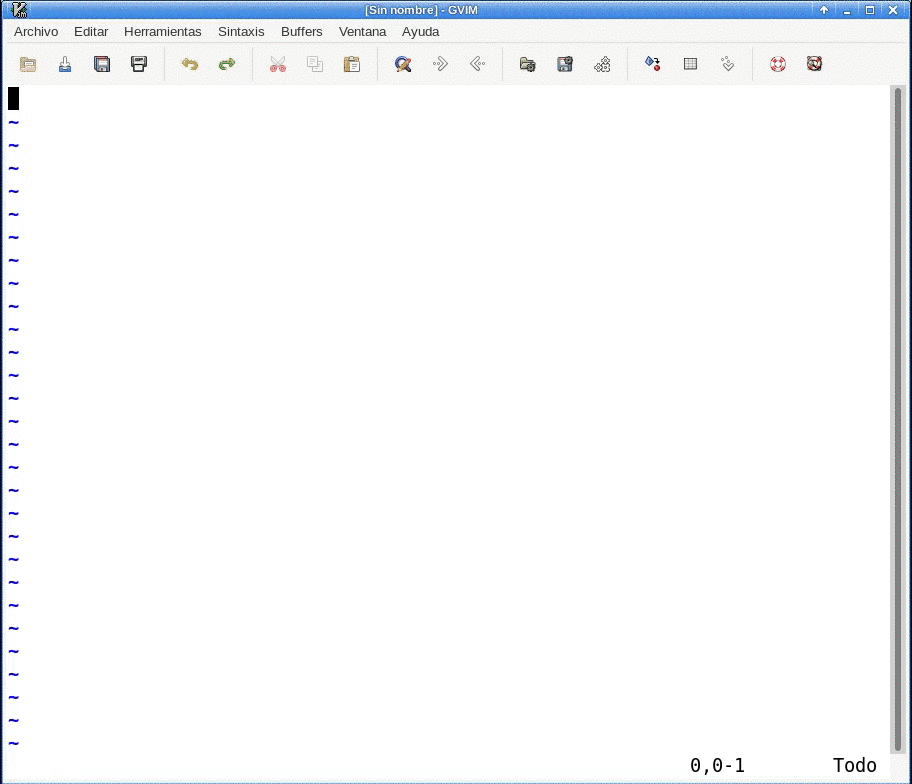

## What is Csound?
Csound is an open source sound and music computing system originally developed in 1985 at MIT.

<!-- .element: style="width: 200px;" -->

https://github.com/csound/csound
 
https://csound.com

It is an audio coding language that can generate and modify sound.

---

<!-- .element: style="width: 250px;" -->
 
**It was originally written in the "C" language**

and it now uses C++, too.

It has APIs for C and C++, and API bindings for Python, Java, and Lua.

<!-- .element: style="width: 500px;" -->

---

**Csound is small and highly portable.**

It runs on all major operating systems, iOS, Android and embedded systems like Raspberry PI and COSMO:
 <!-- .element: style="width: 500px;" -->

---

It also compiles to WASM and runs in the browser.
<!-- .element: style="width: 500px;" target="blank" -->

---

## How is Csound used?

The old-school way is to write a text file that Csound understands, save it, and run the **`csound`** command with it in a CLI terminal.

---

There are also "frontends" that are GUIs for editing and running Csound files:

[Cabbage](https://cabbageaudio.com/),
[CsoundQt](https://csoundqt.github.io/),
and [Blue](https://blue.kunstmusik.com/)

<!-- .element: style="width: 700px;" -->

---

[Cabbage](https://cabbageaudio.com/) is my favorite because it can create plugins for audio apps like LMMS, Reaper, Logic, ProTools, Ableton Live, etc ...

<!-- .element: style="width: 700px;" -->

---

There are also Emacs modes: 
[Csound-x](http://www.zogotounga.net/comp/csoundx.html)
and [csound-mode](https://github.com/hlolli/csound-mode)
 
 
a [VIM plugin](https://github.com/luisjure/csound-vim)

<!-- .element: style="width: 300px;" -->

and a [VSCode extension](https://marketplace.visualstudio.com/items?itemName=kunstmusik.csound-vscode-plugin)

---

### Getting started with Csound

There are lots of resources for learning Csound at https://csound.com/get-started.html

It has an active and beginner-friendly community: https://csound.com/community.html

... and there is a Discord server: https://discord.com/invite/kp92qyHkjq

See you there!

---

## Questions?
 
 
 
 
 
 
Made with reveal.js:

https://github.com/docEdub/240312-kyoss-csound-and-cabbage-overview.